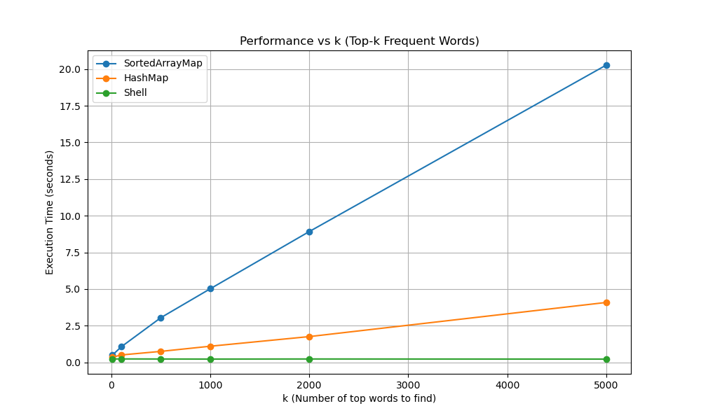

# Word Frequency Analyzer (Top-K Words)

## Overview
This repository contains a Java-based text analysis tool designed to efficiently extract the top $k$ most frequent words from large text files. 

The primary objective of this project was to explore data structure efficiency and algorithmic optimization by comparing custom Java implementations against native Unix pipeline commands.

## Performance Benchmarks


## Implementation Evolution

The project was developed in three main iterations to overcome sequential performance bottlenecks:

### 1. Custom Sorted Array (`SortedArrayMap`)
* [cite_start]The project began with a naive implementation, which was later upgraded to a Sorted Array implementation[cite: 2].
* [cite_start]A major breakthrough was discovering the "index trick"[cite: 4].
* [cite_start]When `binarySearch` does not find an item, it returns the exact position where the item should be inserted[cite: 5].
* [cite_start]Utilizing this negative return value for direct insertions provided a 4x speed boost compared to the initial version[cite: 6].
* [cite_start]However, a scalability wall was hit: asking for the top 5000 words caused execution time to exceed 20 seconds[cite: 8, 9].

### 2. Hash Table Transition (`HashMapWordFreq`)
* [cite_start]To resolve the scalability issues, the underlying data structure was switched to a `HashMap`[cite: 11].
* [cite_start]This transition provided a significant performance bump[cite: 11].
* [cite_start]Despite this, the program still struggled to outperform the native Unix shell command[cite: 12].

### 3. Optimized Hybrid Approach (`HashStreamHybrid`)
* [cite_start]Profiling revealed that standard Java tools like `split()` and `replaceAll()` were the primary bottlenecks[cite: 13].
* [cite_start]These were replaced with a manual C-style loop that reads the file character by character[cite: 14].
* [cite_start]Combining this manual parsing loop with Java Streams for sorting allowed the program to execute faster than the Unix shell command itself[cite: 15].

## Usage

```bash
# Compile the optimized hybrid analyzer
javac HashStreamHybrid.java

# Run the analyzer on a text file to find the top 10 words
java HashStreamHybrid textfile.txt 10

# Run the analyzer for the top 5000 words
java HashStreamHybrid textfile.txt 5000
